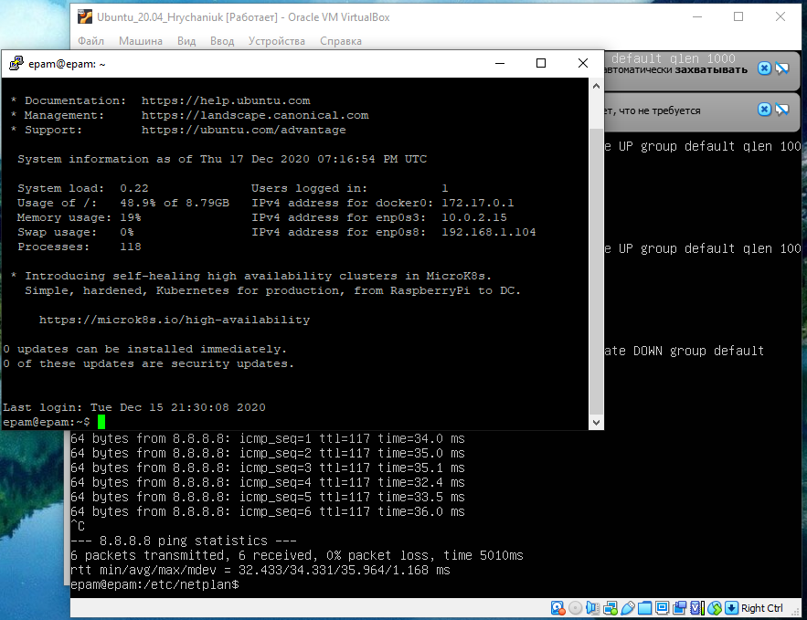
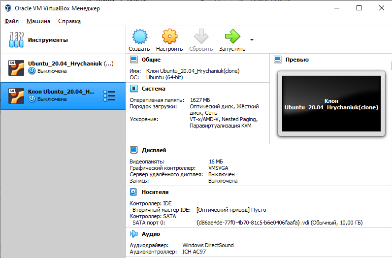
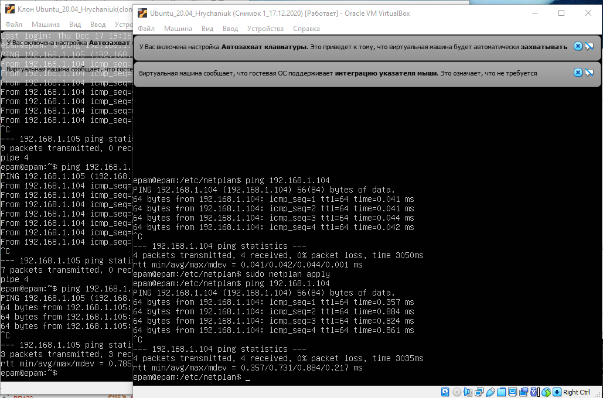
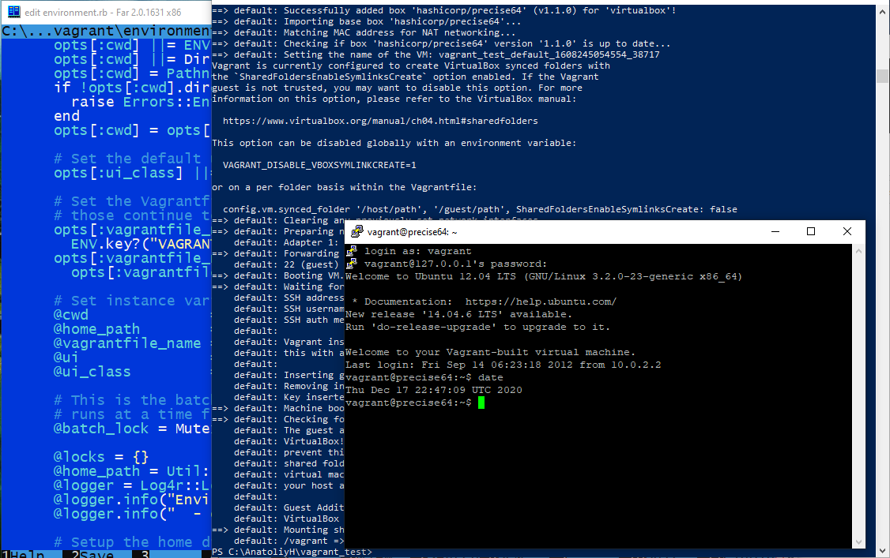
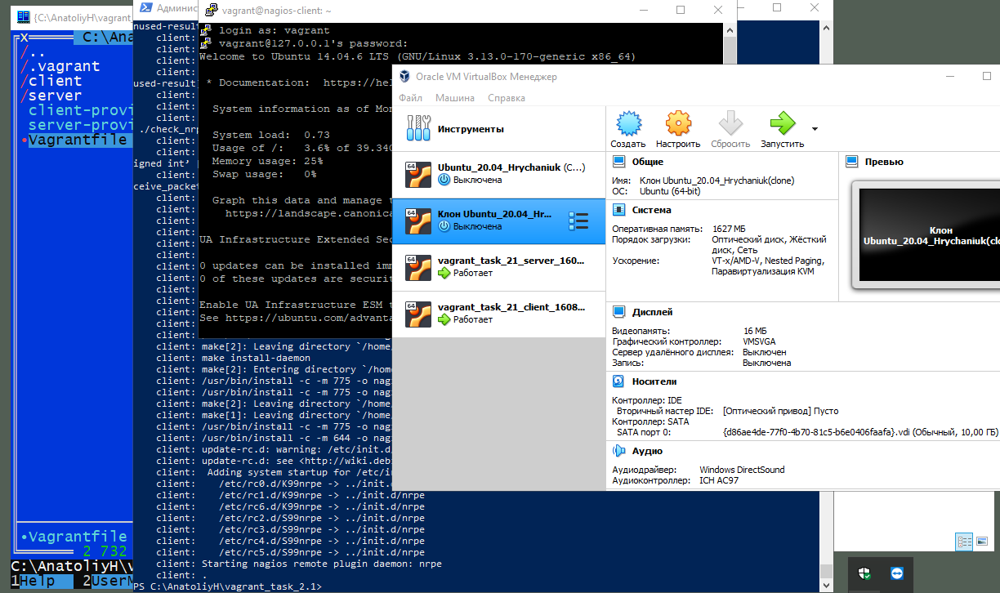

# task_2.1

<h4 align="center">PART 1. HYPERVISORS</h4>
1 - Most popular hypervisors for infrastructure virtualization is
    VMware vSphere Hypervisor, Microsoft Hyper-V, Citrix XenServer, Oracle VirtualBox.
2 - Main differences of the most popular hypervisors
	 Type 1 hypervisor: hypervisors run directly on the system hardware – A “bare metal” embedded hypervisor
	 like VMware ESX and ESXi, Microsoft Hyper-V, Citrix XenServer
     Type 2 hypervisor: hypervisors run on a host operating system that provides virtualization services, 
     such as I/O device support and memory management.
     Hypervisors like VMware Server, Oracle VM VirtualBox, KVM.

<h4 align="center">PART 2. WORK WITH VIRTUALBOX</h4>

Download and inslall VirtualBox, create VM1 and install Ubuntu 20.04
Acquainted with the possibilities of VM1 control -start, stop, reboot, 
save state, use Host key and keyboard shortcuts, mouse capture.
Connect from Putty on VM1

Clone an existing VM1 by creating a VM2, configured of virtual machines

Configure  different  network  modes  for  VM1,  VM2.  Check  the  connection between VM1, VM2 used ping

<h4 align="center">PART 3. WORK WITH VAGRANT</h4>

Download the required version of Vagrant, Run the powershell created the folder.
Solve problem to initialize vagrant.
Initialized the environment with the default Vagrant box, run vagrant up.
Connected  to  the  VM  using  the  program  PuTTY, executing the date command.

Create your own Vagrant box

