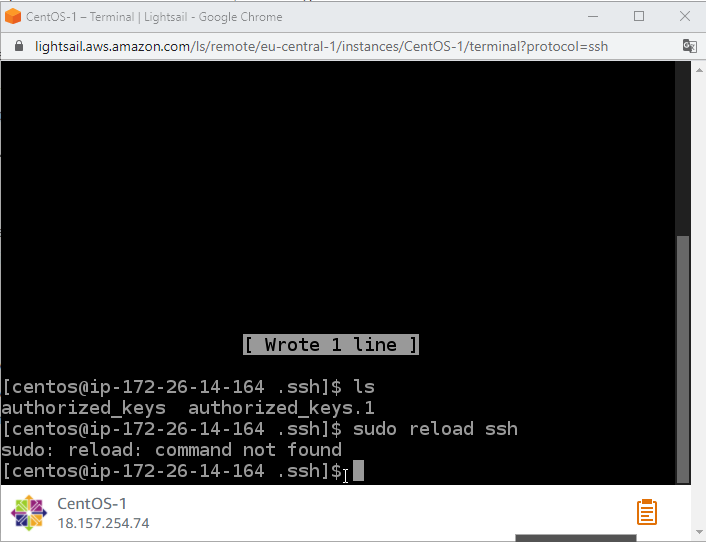

# task_2.2

<h3 align="center">Registered on AWS</h3>

Launched  Virtual Machine With Amazon Lightsail
Created and configured CentOS operating system, WordPress instance

Created and attach a Disk_D (EBS) to my instance.
Created and save some file.

Created a snapshot of my instance

<h4 align="center">Amazon S3<h4>

Created and upload files to the cloudto Amazon S3

Created domain and configured on Route 53

<a href="http://www.epam-studu.link/">Link on my domain Route 53</a>

