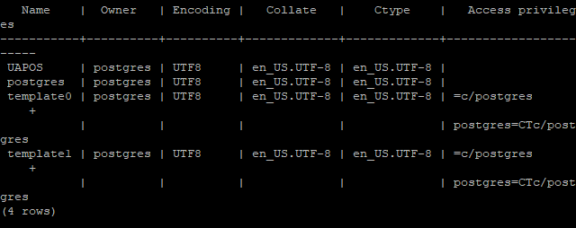
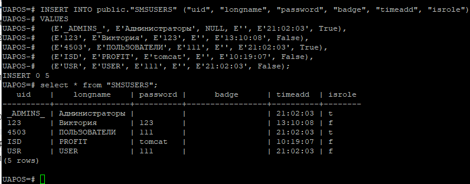
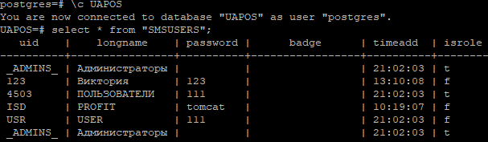
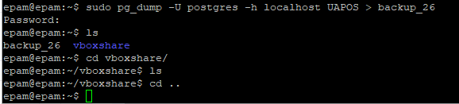
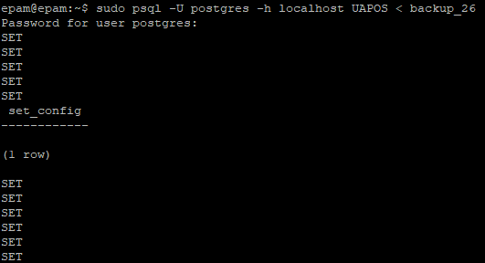

# task_3.1

<h3 align="center">Module 3 Database Administration</h3>

<h4 align="center">PART 1</h4>

 Download postgreSQL server for my OS on VM.
 Install postgreSQL server on VM.
Create a database on the server via the console.
Fill the tables.

Construct and execute SELECT operator
_select uid, password from "SMSUSERS" where isrole = f group by uid;_
select all 
select * from "SMSUSERS"

Create a database of new users
_sudo -u postgres psql -c "ALTER USER isd PASSWORD 'tomcat'"_
_sudo -u postgres psql -c "ALTER ADMIN pqnet PASSWORD 'pqnet'"_

<h4 align="center">PART 2</h4>

Made backup of my database

Deleted the part of the data in the table
then made restore from my dadabase

Created database on RDS AWS

<h4 align="center">PART 3<h4>

