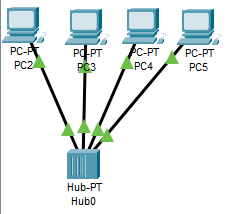
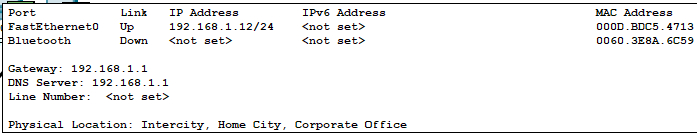
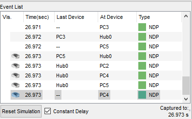
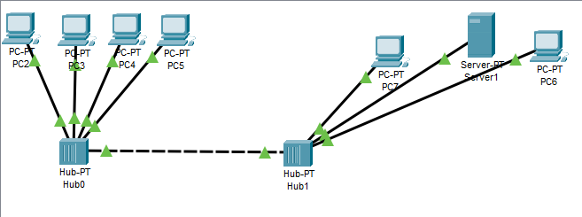
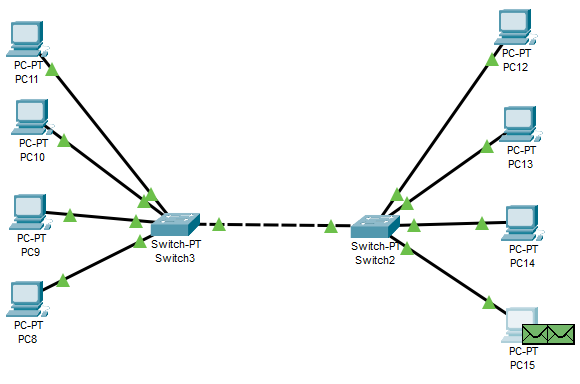
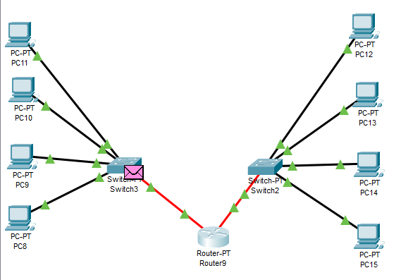

# task_4.1

<h3 align="center">Networking Fundamentals</h3>

Assemble the next project
4 PCs such as PC-PT, Hub-PT. connected by (Copper Straight-through)

assigned each PC its own IP

Checked the working ability

Assemble the next project with 2 Hub-PT

Created a new project with 4 PCs and a switch, 
were connected (Copper Straight-through)
then add 4 PC and 1 switch. Connected two swithes with Copper Cross-over 

Divided the existing network into two subnet levels. And connected them for
using a Router-PT router with multiple ports.

Router ports turned on and assign them an IP
addresses

PC8  - 192.168.1.8   PC12  - 192.168.2.12 		
PC9  - 192.168.1.9   PC13  - 192.168.2.13
PC10 - 192.168.1.10  PC14  - 192.168.2.14
PC11 - 192.168.1.11  PC15  - 192.168.2.15

