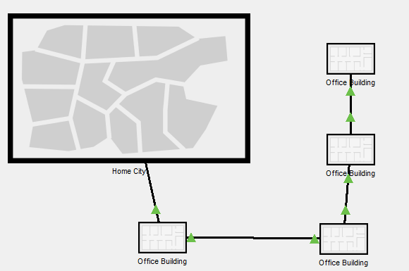

# task_4.2

<h3 align="center">Networking Fundamentals</h3>

Simulated a corporate network comprising 5 PCs.
One router and two switches

Simulated a corporate local area network consisting of 5 - 6 PCs.
One router for one port and a few switches

Stored the file with Cisco Packet Tracer in folder task_4.2

