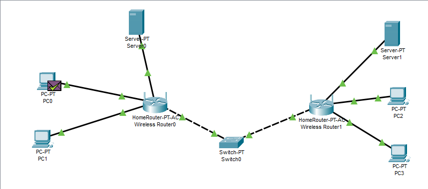
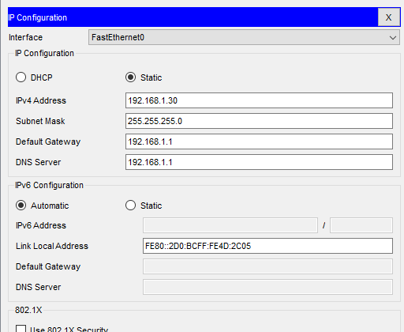
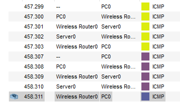

# task_4.3-4.4

<h3 align="center">Registered on AWS</h3>

Built a local network based on one switch and 
two routers with 4 PCs and two Servers

Configured routing according to the protocol RIP
Successfully sent data on the ICMP protocol
Provided static addresses for PCs and servers

Saved the file with Cisco Packet Tracer in folder task_4.3-4

