# task_5.1

<h3 align="center">PART_1</h3>

Logged in to the system and switch as root.

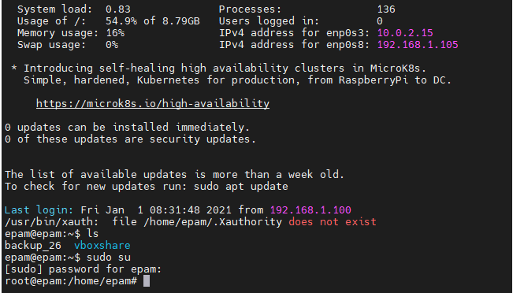

Used the passwd command to change the password.

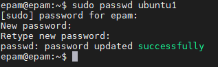

 The /etc/passwd file records your full name and the path name of the shell that you use. 
 To change your recorded name.
 If we chahged Password An x character indicates that encrypted password is stored 
in /etc/shadow file. 
Need to use the passwd command to computes the hash of a password typed at the CLI or 
to store/update the hash of the password in /etc/shadow file.

Determined the users registered in the system.

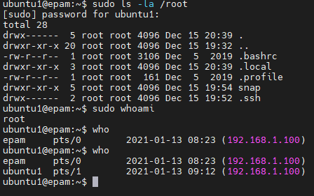
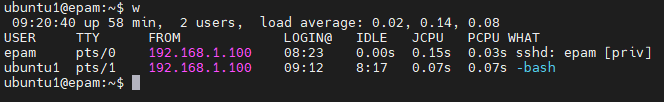

 who command is used to find information :
 1. Time of last system boot
 2. Current run level of the system
 3. List of logged in users.
 If w command is used we find information :
  List of users and their activities, tty, time login, PCPU What they doing.

Change personal information about yourself.

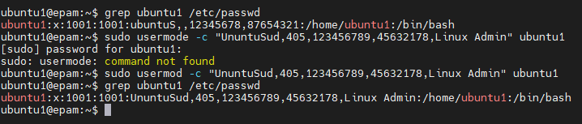

Linux system and the man and info commands.

Examples:

-v, --variable VAR=VALUE     assign VALUE to Info variable VAR
info -f ./foo.info           show file ./foo.info, not searching dir
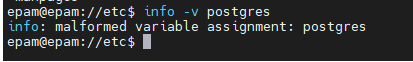

info command reads documentation in the info format.
 It will give detailed information for a command when compared with the man page. 
The pages are made using the texinfo tools because of which it can link 
with other pages, create menus and easy navigation.

 
-I, --match-case           look for pages case-sensitively
 -w, --path, --location     print physical location of man page

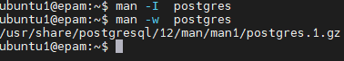

 _more_ command is used to view the text files in the command prompt, 
 displaying one screen at a time in case the file is large (For example log files). 
 The _more_ command also allows the user do scroll up and down through the page. 
 The syntax along with options and command is as follows. 
 Another application of more is to use it with some other command after a pipe. 
 When the output is large, we can use more command to see output one by one.

_+num_ This option displays the text after the specified number of lines of the document.
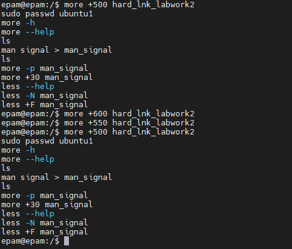

 The _less_ command is also used to open the specified file for interactive reading, 
 allowing you to scroll and search. If the content of the file is too large, 
 it displays on the screen and therefore you can scroll page by page. 
 Unlike the _more_ command, it allows scrolling in both directions. 
 This means that you can scroll up and down the file.

 List the contents of the home directory using the ls command, define its files and directories.

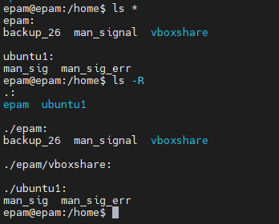

 

<h3 align="center">PART_2</h3>

The tree is a tiny, cross-platform command-line program used to recursively list 
 or display the content of a directory in a tree-like format. 
 It outputs the directory paths and files in each sub-directory and 
 a summary of a total number of sub-directories and files.

The _-f_ list of the directory contents with the full path prefix 
for each sub-directory and file.

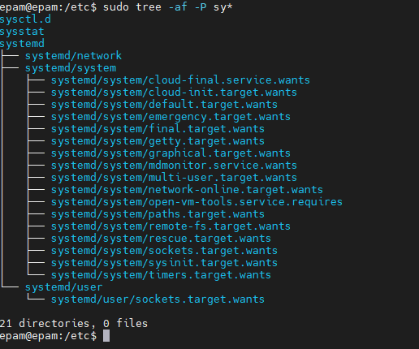

The _-c_ show Sort files by last status change time

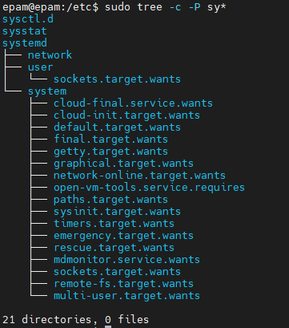

For determine the type of file we can  used command _file_

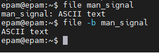

Navigating the file system using relative and absolute paths.

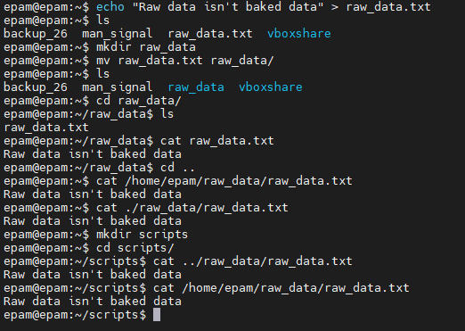

Go back to my home directory from anywhere in the filesystem 

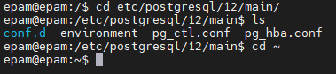

The various options for the ls command.

-a - with hidden
 -l - formatted one-column list 
 (displays file type, file access rights, number of hard links to the file, 
 owner name, group name, file size (in bytes), timestamp and file name.)

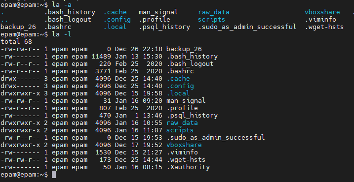

-R - list with sub-directories
 

 

-S - sort by size (large to small)
 
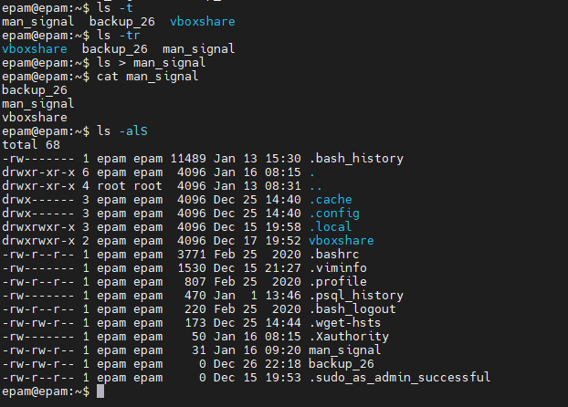

Created a subdirectory in the home directory and file containing information about directories

After moving the file, deleted the file with the directory
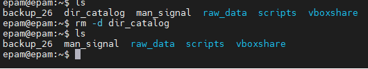
 
 Created a test subdirectory in the home directory.
 Copied the .bash_history file to this directory, changing its name to labwork2
 Created a hard and soft link to labwork2 file in the test sub-directory.

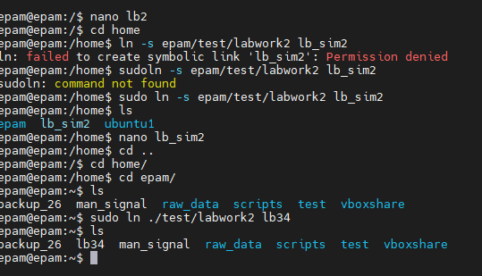

 Renamed the hard link file to hard_lnk_labwork2.
 Softlink file to symb_lnk_labwork2.
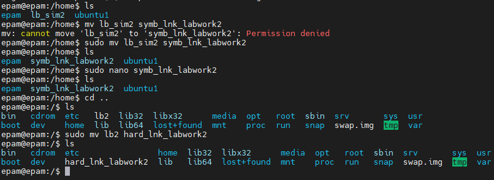

 Hard links are more flexible and stay linked even if the original or 
 linked files are moved around the file system
 
 Soft links can be linked on different file systems, although if the original file is
 deleted or moved, the programmatically linked file will not work correctly (this is called a hung link)

 After deleted the labwork2 my soft link didn't work, but hard links show me information

Using locate utility, I found all files containing squid and traceroute sequence.

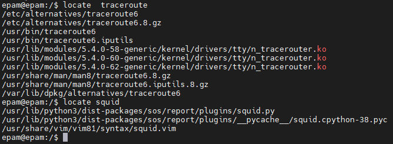

 Determined which partitions are mounted on the system, as well as the types of these partitions.
 Counts the number of lines containing a given sequence of characters in the given file and the number of lines.

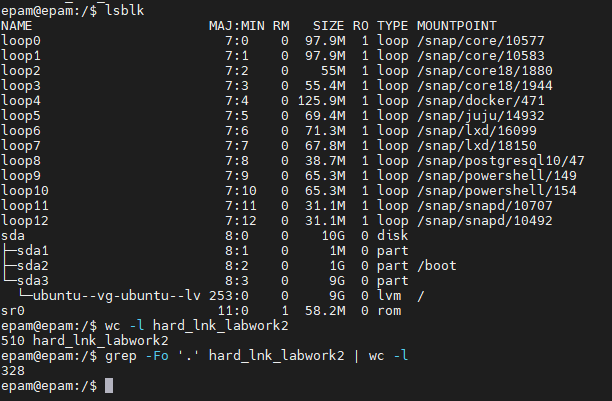

Using find command, found files in / etc directory containing host character sequence.

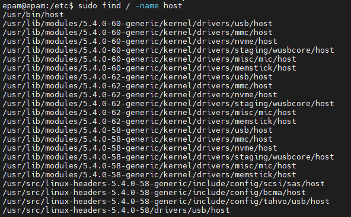

Found objects in / etc containing the character sequence ss. duplicated a similar command using grep.

Organized step-by-step printing of the directory contents / etc.

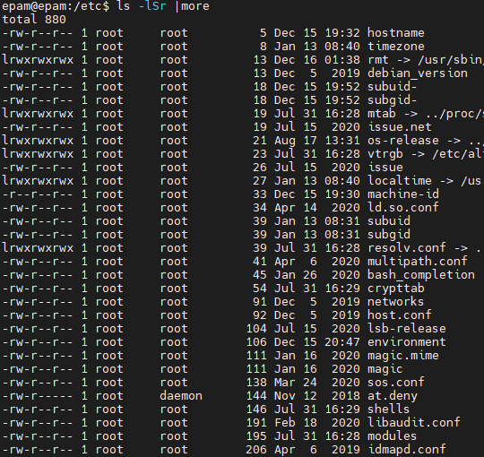

 Linux supports three types of hardware device: character, 
 block and network. Character devices are read and written directly without buffering, 
 for example the system's serial ports /dev/cua0 and /dev/cua1. 
 Block devices can only be written to and read from in multiples of the block size, 
 typically 512 or 1024 bytes. Block devices are accessed via the buffer cache and 
 may be randomly accessed, that is to say, any block can be read or 
 written no matter where it is on the device.

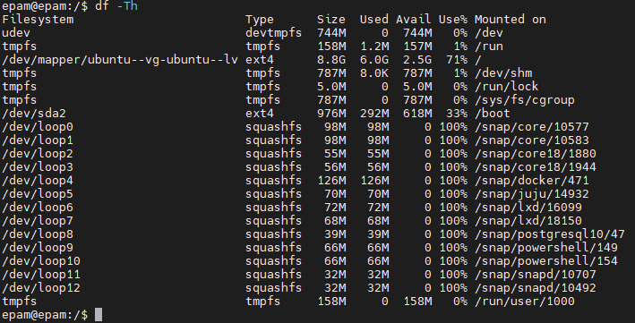

 In Linux there are basically three types of files:

 *Ordinary/Regular files
 *Special files
 *Directories
                      
 List of the first 5 directory files that were recently accessed in the / etc directory.

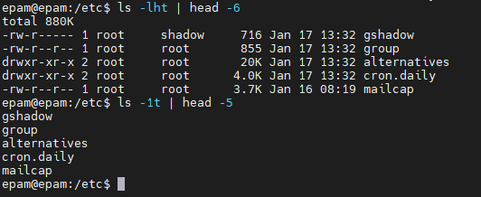

