# Task 5.2

<h3 align="center">Linux tesk 5.2</h3>

### 1

 The _/etc/passwd_ file contains all user information except for the password. 
 One line from this file corresponds to the description of one user. 
 A string consists of several fields, each separated from the other by a colon.

 In / etc / group, information about groups is stored.
 
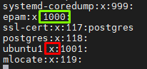

In pseudo-users who do not use the user's shell, 
 their user ID (UID) starts from "1" through "999".
 Themost used are:
 daemon, bin, adm, nobody, sshd.

### 2

Uid ranges are from 1000 to 65535 for regular users.
 The UID is the number assigned to every Linux user,
 used to identify the user on the system and to 
 determine which system resources the user can access. 
 
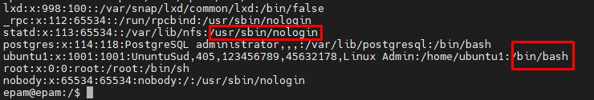

 ubuntu1:        _Login username_
 x:			    _Encrypted password_
 1001:1001:		_Numeric user identifier (UID):Numeric group identifier (GID)_
 Linux Admin: 	_Comment field_
 /home/ubuntu1:  _User's home directory_
 /bin/bash 		_User shell_.

### 3

GID (Group ID) - User groups are used to organize access for several users to 
 some resources. The group, like the user, has a name and identification number.

 You can see the group information in the / etc / group file

 ubuntu1:			_Name Group_
 x:					_Encrypted password_
 1001:               _ID Group_
 Vasia, Petia,Masha  _List of users in the group_

### 4

You can use this command groups <group name> so you can see who is in this group
 
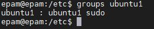
 
Or you can use other commands for output
 grep '^_group_name_:' /etc/group
 getent group _<group_name>_
 groupsmems -g _<group_name>_ -l

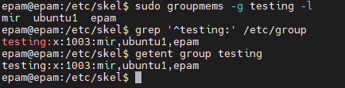

### 5

You can add a user with the following commands:

 useradd _user_name_
 It is a low-level utility for creating users.
 
 adduser _user_name_
 After running this command, you must enter the password for the new user. 
Then you will be prompted to enter additional information about the user
 
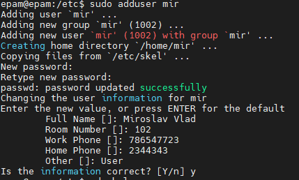

 
The main parameters that are needed to create a user are creating a password, 
belonging to a group, when creating a user using _useradd_, 
create a home directory in advance, copied the default files for users from the 
_/etc/skel_ directory, and then create a user and assign it to the home directory 
 
_sudo cp - rT /etc/skel /users/name_
 It is possible to take an easier way using the -m key
 _sudo useradd -m pupkin_
 Thus, the home directory is created by default in the /home directory. 
The directory name is the same as the username.

### 6

To change the account name, use the following:
  usermod -l _<newName> <oldName>_

### 7

_skell_dir_ is a directory containing files to copy to a newly created custom directory.

 
Structure _skell_dir_:
 
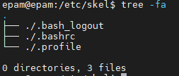

### 8

To delete a user and his files, you can use the command:
 
userdel -r _userName_ 
 
Force deletion of files even if they do not belong to the user.
You use -f.

### 9

To lock out a user with command, you can use the -l / -L option as follows:

 
passwd -l user_name
 
Or 
usermod -L user_name
 
To unblock a user with a command, you can use the -u / -U option:
 
passwd -u user_name
 
Or 
usermod -U user_name
 

### 10

You can force the change user on next login with commands _chage_ or _passwd_
 
chage --lastday 0 user_name
 
Or 
 
passwd --expire user_name  

### 11

At the output of the _ls -la_ command we can see columns

First column is right for our user. 

The second column shows how many directories or files are in a specific directory. 

The third column shows the owner of the directory. 

The fourth column shows the group in which the directories are located. 
                                                 
The fifth column shows the size of the directory.

The sixth column shows the last date the directory or file was modified

### 12

Access rights are divided into three categories:
 
*User - rwx
*Group - rwx
*Other users - r-x

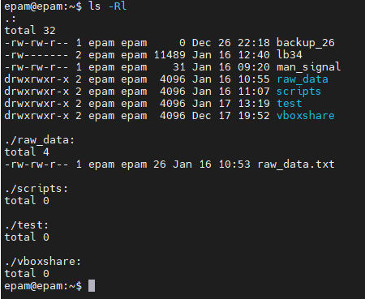

 
Example
 
drwxrwxr-x
 
d - directory
r - access to read
w - access to write
X - access to execute
 
If  you have so access _r-x_
 This means that there are no rights to modify or delete a file or directory.

### 13

 With the help of access rights, we can determine what a user or group can do with a directory or file. 
 We can also change access to one or several users or groups. 
 Allowing read or write with read.

### 14

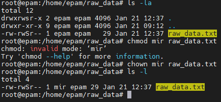
 

Changing the owner of a file can be done with the chown _new-user_ _file_ command.
 To access a file or directory. You need to add the user to the group with 
 the command usermod -a -G group user.

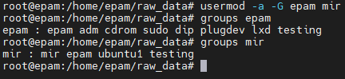

### 15

Use octal designators instead of "r", "w" and "x". 
 Each octal designation can be used by any of the groups 'u', 'g', 'o'.

 
Octal designations for umask are as follows:
 
Octal value: resolution
 0: read, write and execute
 1: read and write
 2: read and follow
 3: read only
 4: write and execute
 5: write only
 6: execute only
 7: no permissions

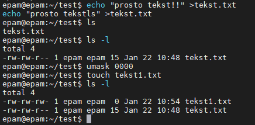

 
Octal designations for are as follows:
 
 rwx	7 
 rw-	6 
 r-x	5 
 r--	4 
 -wx	3 
 -w-	2 
 --x	1 
 ---	0 

 chmod ugo+rwx file_name
 chmod 777 file_name

 

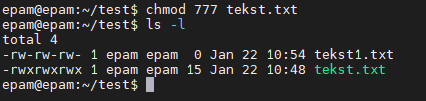

### 16

 A Sticky bit is a permission bit that is set on a file or a directory that lets only 
the owner of the file/directory or the root user to delete or rename the file. 
 No other user is given privileges to delete the file created by some other user.
 
For to set the sticky bit:
 chmod +t my_dir
 
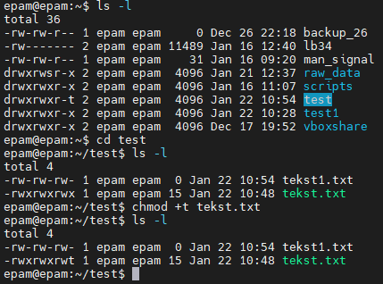
 
To check, run the command:
 
find . -perm /1000
 
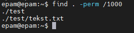
 

### 17

 Each file and directory has access which is divided into three parts: 
 the first part _rw-_ responsible for the owner of the file or directory; 
 the second part _rw-_ responsible for the users who are in the group; 
 the third part _r--_ denotes everyone else.
 
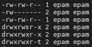
