# EPAM_lectures
Courses of DevOps

### part 1

#### 1

_ps aux_ command

In the STAT column, you'll see lots of values. 
 A linux process can be in a number of different states. 
 The most common state codes you'll see are described below:

 R: running or runnable, it is just waiting for the CPU to process it
 S: Interruptible sleep, waiting for an event to complete, such as input from the terminal
 D: Uninterruptible sleep, processes that cannot be killed or interrupted with a signal, usually to make them go away you have to reboot or fix the issue
 Z: Zombie are terminated processes that are waiting to have their statuses collected
 T: Stopped, a process that has been suspended/stopped 
 s: a session leader
 l: multi-threaded
 

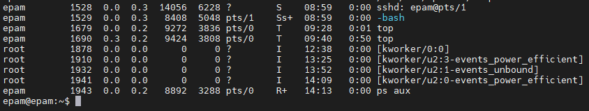

#### 2

_pstree_ is shows all running processes currently active on your logged-in system
 
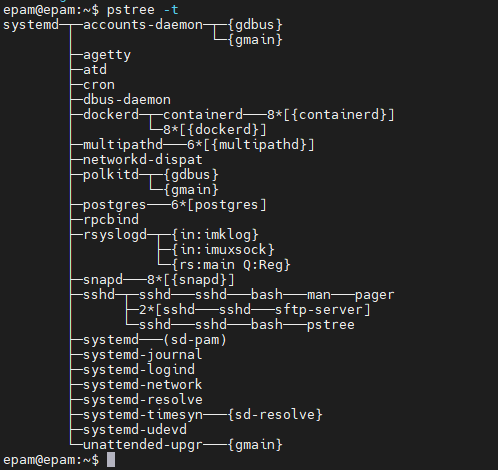

  -t: Show full names for threads when available.
  -s: Show parent processes of the specified process
  -p: Show PIDs.  PIDs are shown as decimal numbers in parentheses after each process name.  -p implicitly disables compaction. 
 
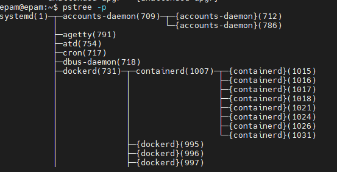

#### 3

proc is a special filesystem used on UNIX-like systems. Allows you to access information from a system process.

 /proc/meminfo, this file is used to get current memory information from the kernel.
 
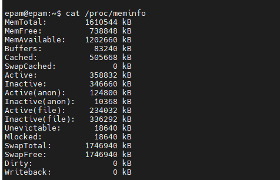
 
 The current values are populated from the kernel.
 We get the most current and accurate system status from files inside /proc.
 
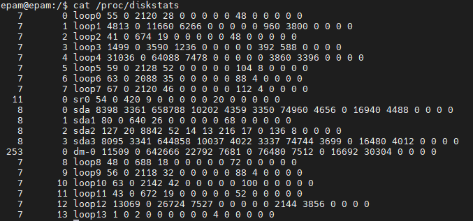
 
 The /proc/diskstats file displays I/O statistics.
block devices. Each line contains the following 14
fields:

 1 main number
 2 junior member
 3 device name
 4 readings completed successfully
 5 reads combined
 6 sectors read
 7 time spent reading (ms)
 8 entries completed
 9 records merged
 10 sectors written
 11 time taken to write (ms)
 12 inputs/outputs in progress
 13 time spent on I/O (ms)
 14 weighted time spent on I/O (ms)
 
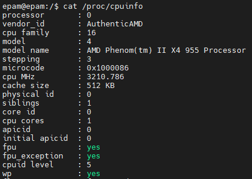
 

/proc/cpuinfo: Contains complete information about the processor.

#### 4
To find details about the cpu on your system
 The command can be:
 
_cat /proc/cpuinfo | grep -i mhz_ - print information about speed of the processor
 
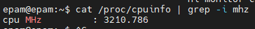
                
_cat /proc/cpuinfo_ or _lscpu_ - print full information about your CPU.
 
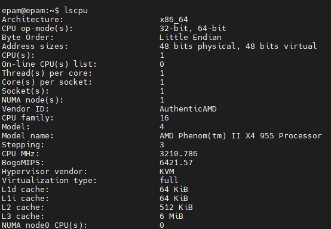

#### 5

 _-e_ shows every process on the system 
  _-o_ is to define the format we want the result
 _-A_ Select all processes. Identical to -e.
 We have specified the format as _user,uid,comm,pid,%cpu,%mem,tty_
 One important point to note here is that by default it sorts ascending. 
 Also _--sort_ needs the parameter to sort by which we provide.

_ps -Ao user,uid,comm,pid,%cpu,%mem,tty,cmd --sort=-pcpu | grep epam_
 
 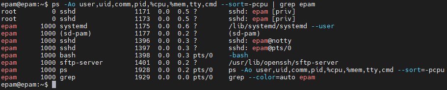
 
_ps -eo user,uid,comm,pid,%cpu,%mem,tty --sort=-%cpu | head -n 6_
 
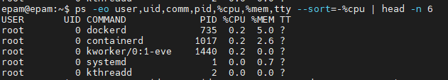

#### 6

Each of the kernel processes starts with its own process number (PID). 
 When managing processes, it is easy to recognize kernel processes because their name 
 is enclosed in square brackets. Command executions: _ps aux | head_ where you can 
 see a couple of kernel threads. As an administrator, it is important to know that streams cannot be controlled, 
you cannot change their priority; 
they cannot be killed except to disable the entire machine.
  
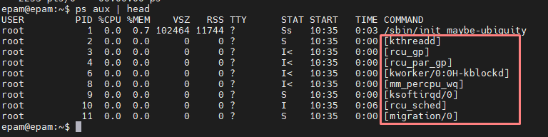

Or you can write this _ps aux k-pcpu | head -6_ to fing kernel process

#### 7
 
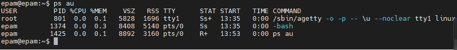
 
 _User_ The username of task owner
 _PID_ The process ID of each task
 _%CPU_ % of CPU time
 _%MEM_ Physical memory used
 _VSZ_ Process virtual memory size in KiB 
 _RSS_ The actual size of the process in memory 
 _TTY_ Terminal type that the user is logged into
 _STAT_ Process status code, which can be Z (zombie), S (sleeping), R (running)
 _START_ The time the command started
 _TIME_ Amount of CPU in minutes and seconds that the process has been running
 _COMMAND_ Command name
 
 
### STAT indicates are:
 
 _D_ Uninterruptible sleep (usually IO)
 _R_ Running or runnable (on run queue)
 _S_ Interruptible sleep (waiting for an event to complete)
 _T_ Stopped, either by a job control signal or because it is being traced.
 _W_ paging (not valid since the 2.6.xx kernel)
 _X_ dead (should never be seen)
 _Z_ Defunct ("zombie") process, terminated but not reaped by its parent. 
 
### The additional characters are:
 
 _<_ high-priority (not nice to other users)
 _N_ low-priority (nice to other users)
 _L_ has pages locked into memory (for real-time and custom IO)
 _s_ is a session leader
 _l_ is multi-threaded (using CLONE_THREAD, like NPTL pthreads do)
 _+_ is in the foreground process group

#### 8

To display only a specific user, we can use several commands
 
 _ps -fu userName_
 _-f_ Do full-format listing.
 _-u_ Selection by effective user ID (EUID) or name
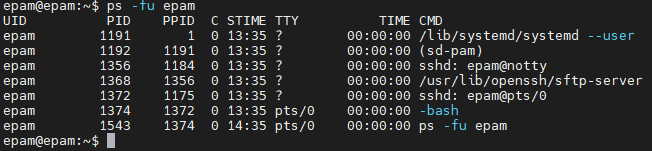
 
 
You can use command _ps -u userName_
 
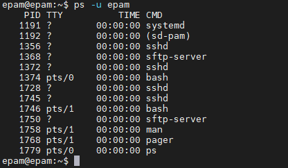
 
Or this command _top -U userName_
 
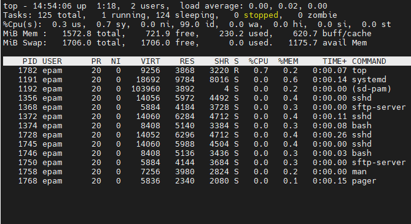

#### 9

To analyze ranning tass you can used several utilities
 _top_
 _pgrep_ - The pgrep command is used to determine the PID of a running program based on various criteria.
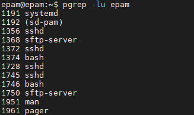
 _pstree_ - Shows running processes in a tree view, displays process hierarchies and makes the output more visually appealing
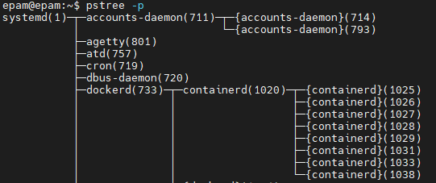
 _proc_ - This virtual file system contains process data and other system information. It appears in / proc and is mounted at boot time.
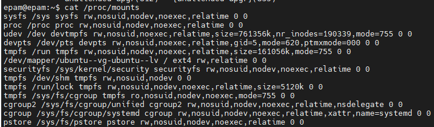
 

#### 10

 _top_ command used to demonstrate Linux processes. 
 It provides a dynamic, real-time view of a running system. 
 Shows a summary of the system and a list of processes or threads that are 
 currently managed by the Linux kernel.
 
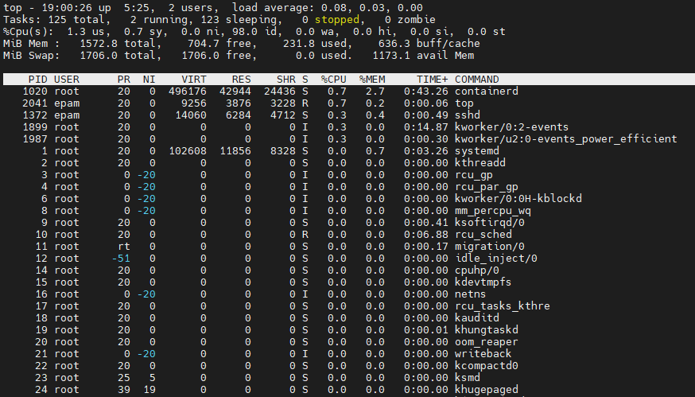
 

#### 11 
To display only a specific user with  _top_ command, you mast write next:
 _top -U name_
 

 

#### 12

 INTERACTIVE Commands
  a. GLOBAL Commands
  b. SUMMARY AREA Commands
  c. TASK AREA Commands
     1. Appearance
     2. Content
     3. Size
     4. Sorting
  d. COLOR Mapping
 
Sorting by user and refreshing every three seconds
 
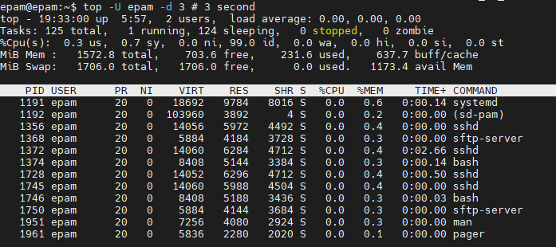
 
Run top then press the _z_ key to toggle the color mode
 
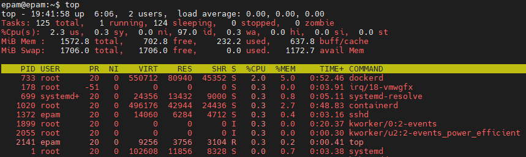
 

#### 13

 
To sort the contents of the process used next commands
 
_ps --sort=-pcpu | head -n 6_
 
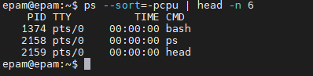
 
Or you can specify columns without interfering with sorting
 
_ps -Ao user,uid,comm,pid,pcpu,tty --sort=-pcpu | head -n 6_
 
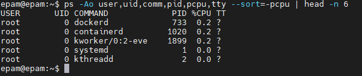
 

Or sort by user
 
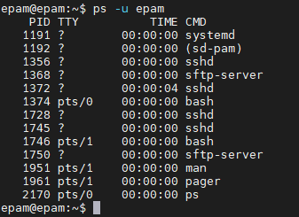
 

#### 14

Change the  Priority of a Process
 
You can change the priority of a process using the nice and renice commands
 _renice_ value (from -20 to +19)
 _Nice_ value range (NI): -20 to 19
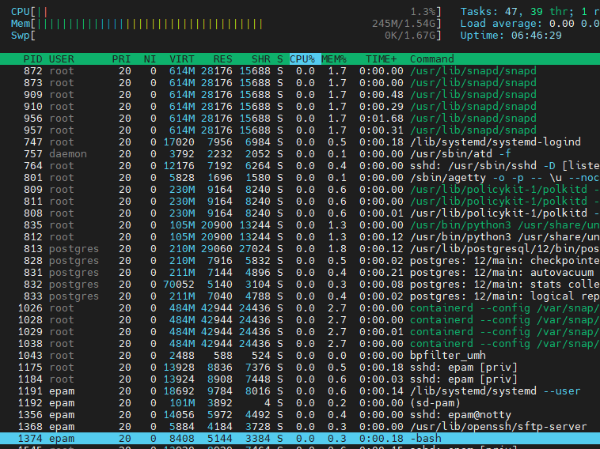
 _ renice -n -2 -p 1374_
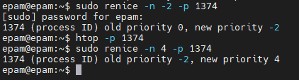
 
_sudo renice -n 4 -p 1374_
 
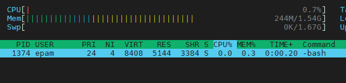
 

#### 15
 
With the command top you can change the priority of the process
 
After receiving the top command, press r.
 
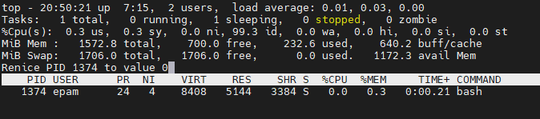 
 Set the PID value of the process whose value you want to change. 
 Specify renice value
 
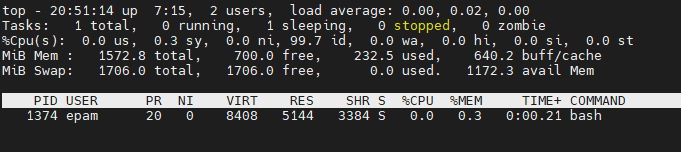
 

#### 16

 
You can view all signals with the command:
 
_kill -l_
 
When you execute the _kill_ command, you are effectively signaling the system to force it to terminate the misbehaving application.
 
The default signal (if not set) is SIGTERM.
 
If it doesn't help, you can use the following options to force the process to terminate:
 
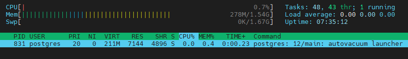
 _kill SIGKILL PID_ 
 or
 _kill -9 PID_
 where the "-9" flag refers to the SIGKILL signal.
 _SIGKILL_ - This signal causes the process to terminate immediately. The program cannot ignore this signal. Unsaved results will be lost.
 
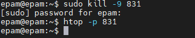

#### 17

 The bg command is designed to restore the operation of stopped processes (tasks) in the background.
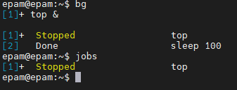
 
The fg command without a parameter will resume the work of the last process stopped by the combination ctrl + z, and if there are none, it will bring the last task to the fore.
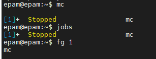

 Also, you will not find help for fg and bg commands (man fg, man bg). Because these commands are part of bash. And you will find a mention of them in man bash.
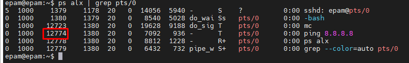

 
_nohup_. This command allows you to start processes that will be disconnected from the terminal if the terminal is closed.

 
Despite the fact that we exited the shell, the process with PID 13010 remained in the system and adopted as the parent, the process with PID equal to 1, that is, the init process. Process 13010 will continue to exist as long as the init process exists, or until we terminate it ourselves with the kill command.
 
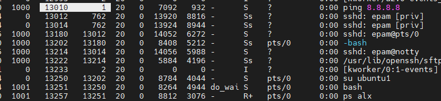

### part 2

To connect via Windows, you must activate the open ssh settings. after which in the shell went or through the command line write _ssh logname @ ip / host_
 
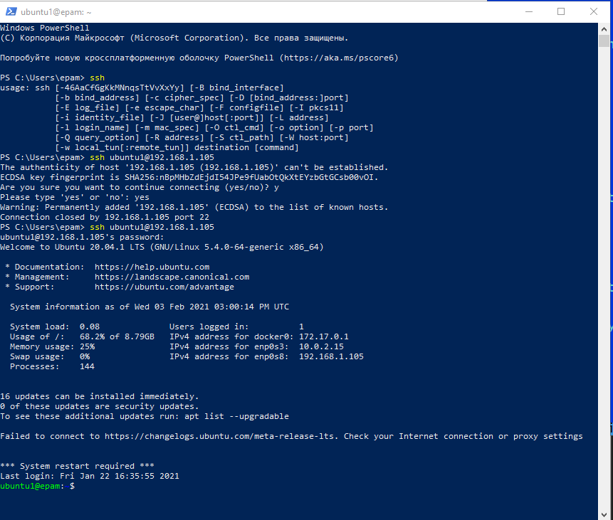

 
Port 22 is the standard port for SSH connections. If you use a different port, it adds a little bit of security through obscurity to your system. 
 
To configure a non-standard port, need edit your SSH configuration file:
 _/etc/ssh/sshd_config_
 
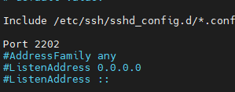
 
Set an Idle Timeout Value
 
We’ve used 300 seconds, which is 5 minutes. 
The SSH connection will be dropped if the inactive period matches the time limit. 
 
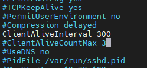
 
It is bad practice to log in as root. You need to disable root log Ins
 
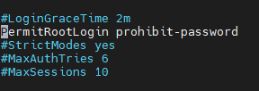                
 
 
SSH key pair can be generated using the ssh-keygen command:
 

ECDSA (the Elliptic Curve Digital Signature Algorithm) keys provide smaller keys and faster operations 
or DSA (2048 bits).
 
_ssh-keygen -t ecdsa -b 521_
 
_ssh-keygen -t dsa -b 521_
 
FOrmat ssh key pair: dsa | ecdsa | ecdsa-sk | ed25519 | ed25519-sk | rsa
 

If you want to create an RSA key pair (2048-16384 bits):
 
_ssh-keygen -t dsa -b 2048_ or another bits.
 
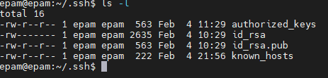
 
To default your key pair store in home directory /.ssh
 
If you want connect whithout password have to do next step in _sshd_config_ file:
 
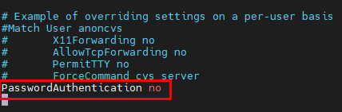
 
Before these actions copy private and public ssh key on your local machine
 
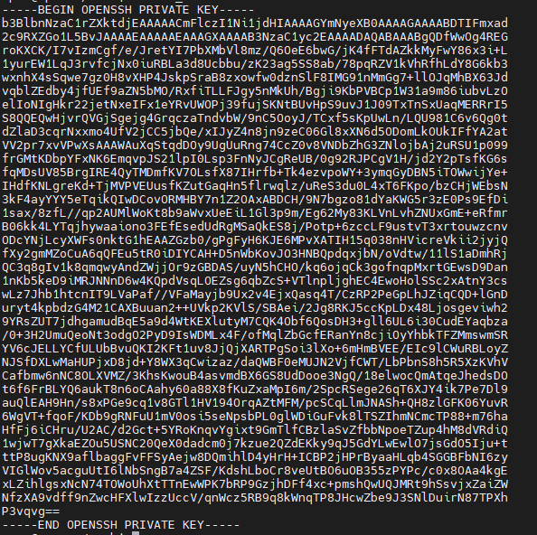
 
After this actions try to connect to your remove machine by first connecting your key to the terminal.
 
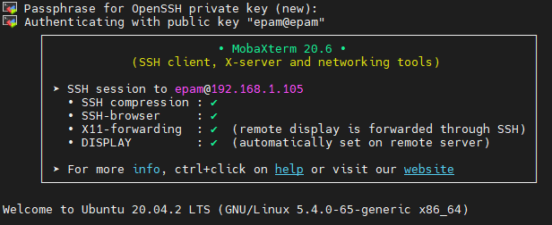

 To enable port forwarding, open the settings for your Virtual Machine 
you'll need to change its network type or forward ports through the virtual NAT
 Open VirtualBox and select the VM you want to alter. Click Settings and then click on the Network tab. 
In the Network window expand the Advanced section and click Port Forwarding

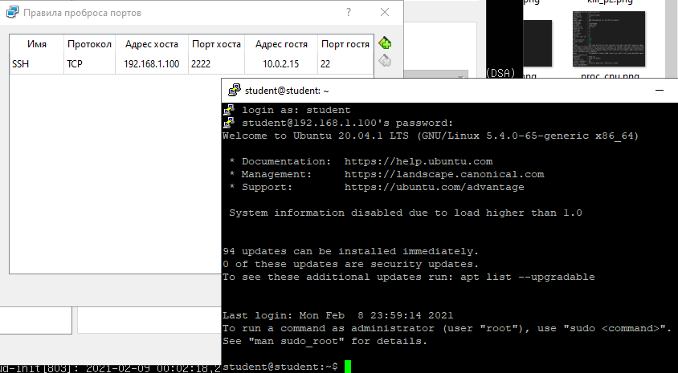

 Tcpdump is a CLI tool this means you can run it remotely in an ssh session, it accepts a many filters and allows you to display data about packets going in and out of an interface. You can also filter syntax which is very powerful.

 Wireshark is a gui tool, you have a nice interface, and like tcpdump, it lets you to capture (or look at recorded captures) packets coming in and out of an interface. You can apply filters to collapse fields you don’t care about while examining a packet. Moreover, wireshark allows you to isolate streams such as a whole TCP session.
 
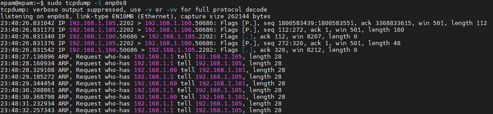
 
_tcpdump_ is a tool for interacting with traffic,
protocol analyzer.
 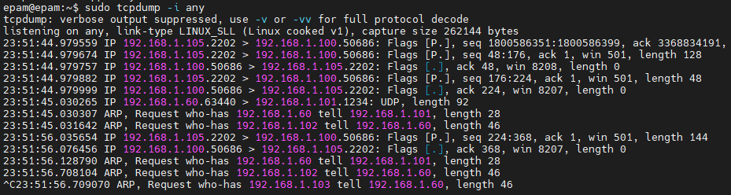
 -i enp0s8: listen on a specific interface (enp0s8).
 -i any: listen on all interfaces to see if there is any traffic.
 -tttt: Sets the default timestamp format for each line.
 -nn: display IP addresses and port numbers instead of hostnames and protocol names.

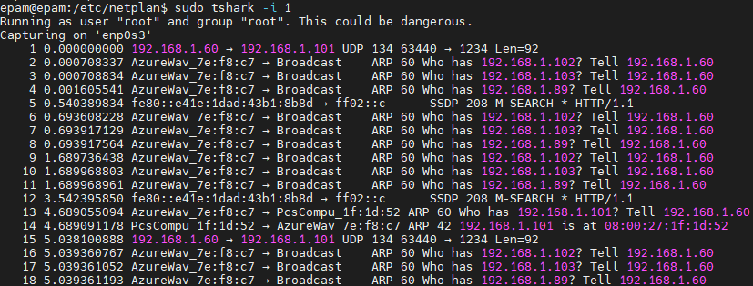
