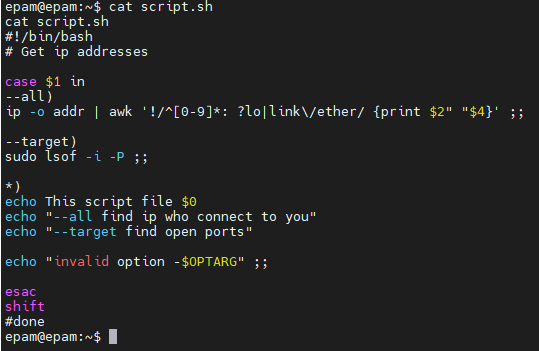
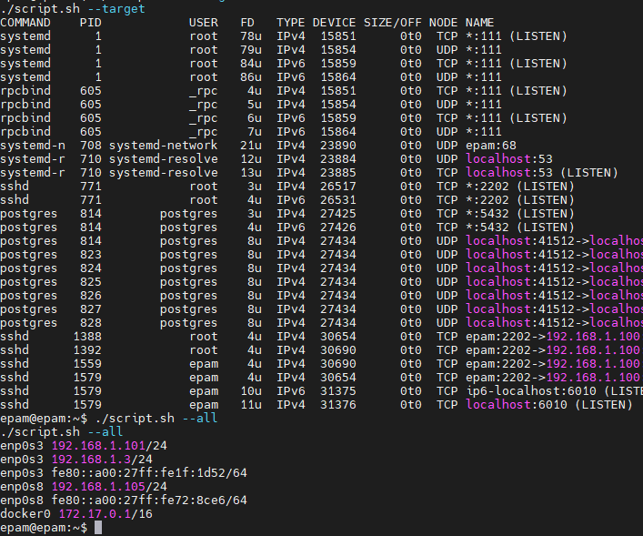
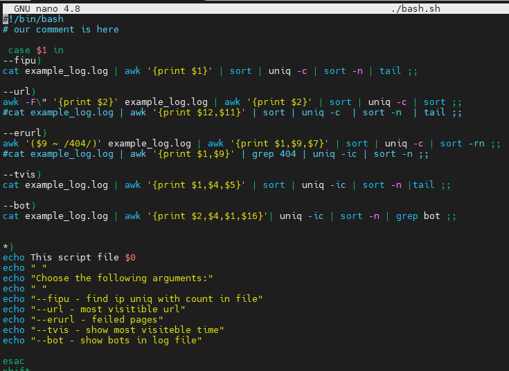
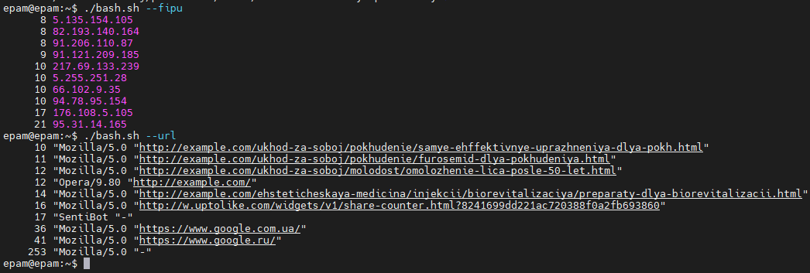
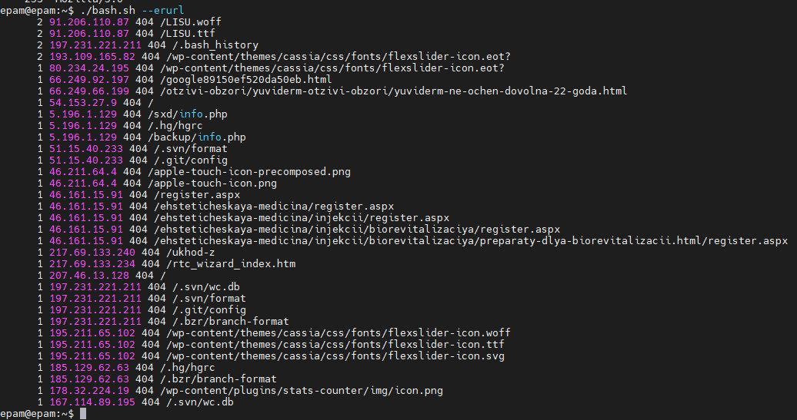
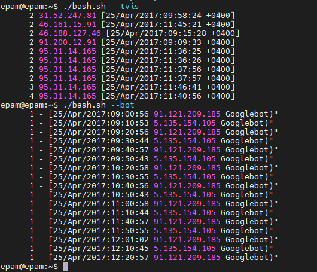
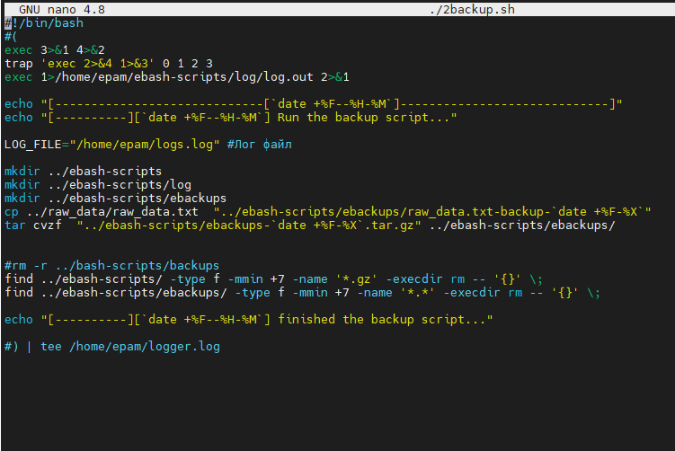
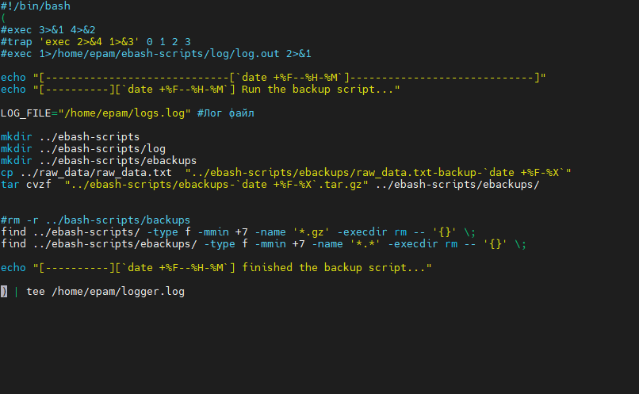
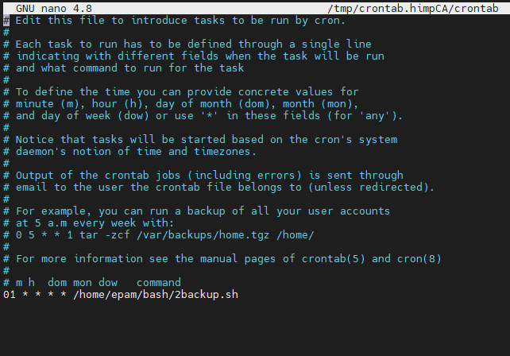
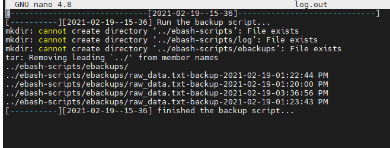

# Linux administration with bash

### A. Create a scrip

 

  "--all - find ip who connect to you"
  "--target - find open ports"
  

### Created a script, using Apache log

  "--fipu - find ip uniq with count in file"
  "--url - most visitible url"
  "--erurl - feiled pages"
  "--tvis - show most visiteble time"
  "--bot - show bots in log file"

 

 

  "--fipu - find ip uniq with count in file"
  "--url - most visitible url"
 

 
  "--erurl - feiled pages"
 

 
  "--tvis - show most visiteble time"
  "--bot - show bots in log file"
 

### Create a data backup scrip

 When creating a script in this way, the script is executed in the background
 

 
 You can also slightly modify this script.
 

 
  Add our script to the crontab for the scheduled launch
 

 
 Check if the log is being written
 
