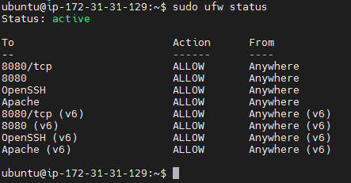

# JENKINS

###  Installed

 Java 1.8
 

  Apache2
  

 Jenkins
  

 Open port on AWS Security Groups and at instance
  
  

 Configured a connection for Jenkins via ssh by key
  

 Wrote html page, created a job for jenkins, completed the job, checked the result.
  code of html page
  
  checked the log jenkins
  
 checked the result on web page.
  

### Created a script
