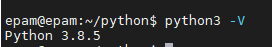
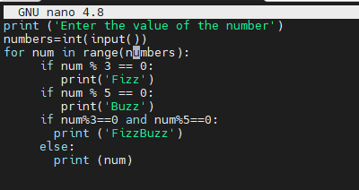
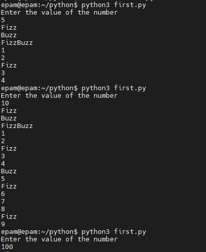
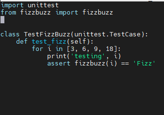
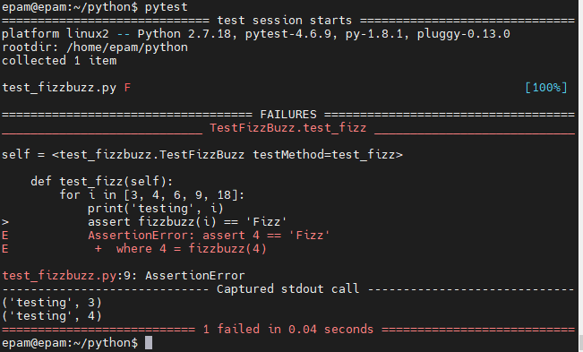
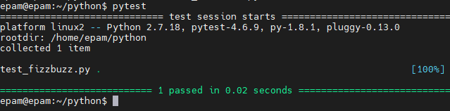
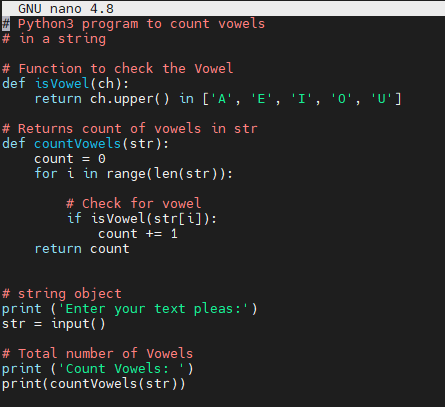
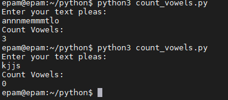

# Python

### function FizzBuzz
 installed python3
 
 Developed fizzbuzz function for list of numbers from 1 to 100.
 
 add enter value in function
 
 

### test_fizzbuzz

 create function test for fizzbuzz
 
 run test function success and failed
 
 

### functoin count vowels

 Developed count_vowels function for counting vowels in input text
 code vawels
 
 Result
 
