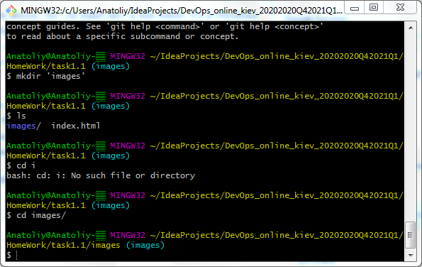
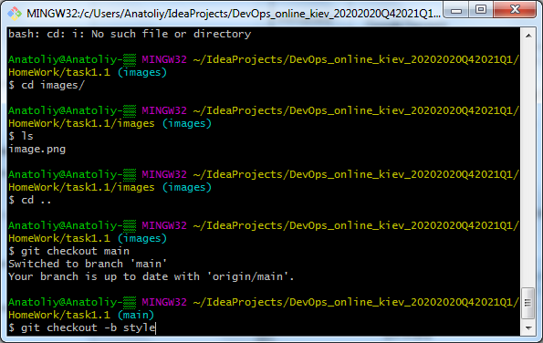
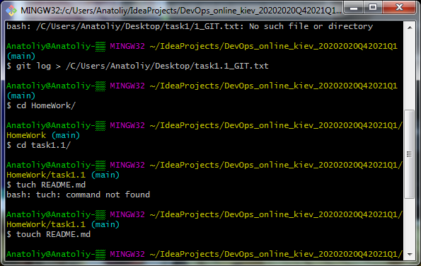
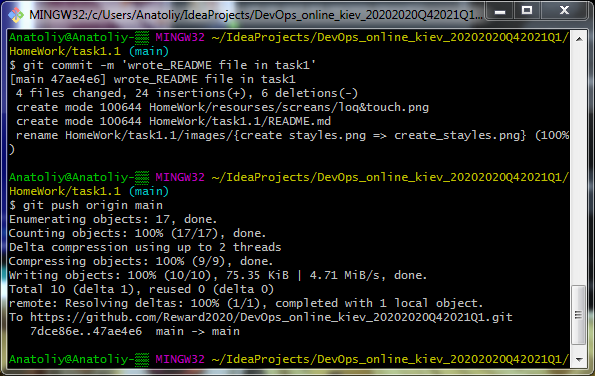

# task_1.1

<h3 align="center">Created branch images</h3>

<h3 align="center">Created branch styles</h3>

<h3 align="center">Created git log _task1.1_GIT.txt_ & _README.md_</h3>

<h3 align="center">Commit & Push</h3>

## Describe of DevOps

_The concept of DevOps originated in 2009 and was intended to solve the problems 
of interaction between teams of development and operation of software products by clients.
DevOps is a teamwork between developers and testing, rather it is a suite or 
“DevOps tool chain” of multiple tools that captures the key aspects of software development and delivery._