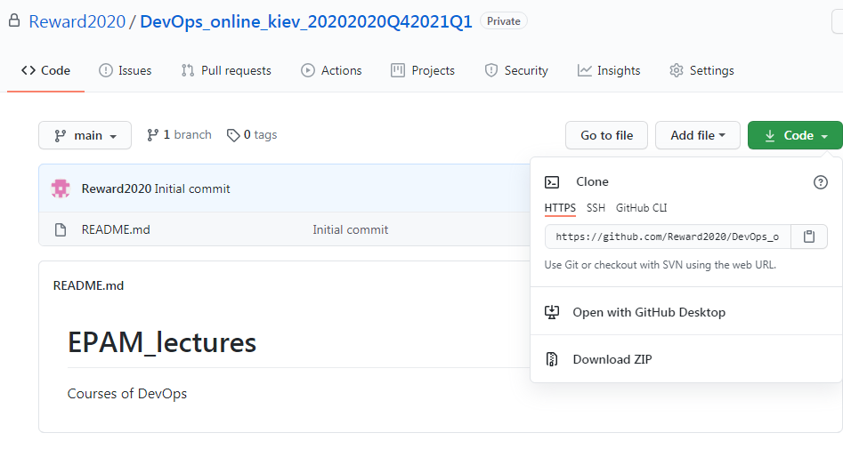

# EPAM_lectures
Courses of DevOps

### step 1

Install git on my PC

### step 2

change my global configs

'''
$ git config --global user.name "Anatoliy"
$ git config --global user.email g.a.s0508657252@gmail.com
'''

enter password

first time create repo public
then corrected in private 

### DevOps_online_Dnipro_2020Q42021Q1

